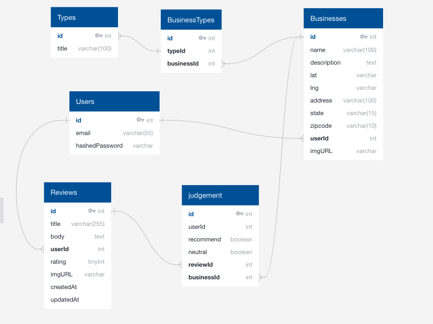

# Drama Deets
Drama Deets is a platform for artists to anonymously share their reviews of art related businesses/classes/instructors.

<!-- PROJECT SHIELDS -->
<!--
*** I'm using markdown "reference style" links for readability.
*** Reference links are enclosed in brackets [ ] instead of parentheses ( ).
*** See the bottom of this document for the declaration of the reference variables
*** https://www.markdownguide.org/basic-syntax/#reference-style-links
-->
[![Contributors][contributors-shield]][contributors-url]
[![Forks][forks-shield]][forks-url]
[![Stargazers][stars-shield]][stars-url]
[![LinkedIn][linkedin-shield]][linkedin-url]

<p align="center">
    
 

  <h3 align="center">Thank you for exploring Drama Deets!</h3>

  <p align="center">
    <a href="https://drama-deets.herokuapp.com/">View Demo</a>
  </p>
</p>

---

<!-- TABLE OF CONTENTS -->
<details open="open">
  <summary>Table of Contents</summary>
  <ol>
    <li>
      <a href="#about-the-project">About The Project</a>
      <ul>
        <li><a href="#built-with">Built With</a></li>
      </ul>
    </li>
    <li>
      <a href="#getting-started">Getting Started</a>
      <ul>
        <li><a href="#prerequisites">Prerequisites</a></li>
        <li><a href="#installation">Installation</a></li>
      </ul>
    </li>
    <li><a href="#usage">Usage</a></li>
    <li><a href="#roadmap">Roadmap</a></li>
    <li><a href="#contributing">Contributing</a></li>
    <li><a href="#contact">Contact</a></li>
    <li><a href="#acknowledgements">Acknowledgements</a></li>
    <li><a href="#mvp">MVP</a></li>
    <li><a href="#front-end-routes">Front End Routes</a></li>
    <li><a href="#back-end-routes">Back End Routes</a></li>
    <li><a href="#redux-architecture">Redux Architecture</a></li>
    <li><a href="#Schema">Schema</a></li>
  </ol>
</details>


<!-- ABOUT THE PROJECT -->
## About The Project

[![Product Name Screen Shot][product-screenshot]](https://example.com)

There are many great README templates available on GitHub, however, I didn't find one that really suit my needs so I created this enhanced one. I want to create a README template so amazing that it'll be the last one you ever need -- I think this is it.

Here's why:
* Your time should be focused on creating something amazing. A project that solves a problem and helps others
* You shouldn't be doing the same tasks over and over like creating a README from scratch
* You should element DRY principles to the rest of your life :smile:

Of course, no one template will serve all projects since your needs may be different. So I'll be adding more in the near future. You may also suggest changes by forking this repo and creating a pull request or opening an issue. Thanks to all the people have have contributed to expanding this template!

A list of commonly used resources that I find helpful are listed in the acknowledgements.
---
### Built With

This section should list any major frameworks that you built your project using. Leave any add-ons/plugins for the acknowledgements section. Here are a few examples.

* React
* Redux
* Google Map API
  * [Places API](https://developers.google.com/places/web-service/overview)
* Flask

---

<!-- GETTING STARTED -->
## Getting Started

This is an example of how you may give instructions on setting up your project locally.
To get a local copy up and running follow these simple example steps.

### Prerequisites

This is an example of how to list things you need to use the software and how to install them.
* npm
  ```sh
  npm install npm@latest -g
  ```

### Installation

1. Get a free API Key at [https://example.com](https://example.com)
2. Clone the repo
   ```sh
   git clone https://github.com/your_username_/Project-Name.git
   ```
3. Install NPM packages
   ```sh
   npm install
   ```
4. Enter your API in `config.js`
   ```JS
   const API_KEY = 'ENTER YOUR API';
   ```
---

<!-- ROADMAP -->
## Roadmap

See the [open issues](https://github.com/ryanblack045/DramaDeets/issues) for a list of proposed features (and known issues).

---

<!-- CONTRIBUTING -->
## Contributing

Contributions are what make the open source community such an amazing place to be learn, inspire, and create. Any contributions you make are **greatly appreciated**.

1. Fork the Project
2. Create your Feature Branch (`git checkout -b feature/AmazingFeature`)
3. Commit your Changes (`git commit -m 'Add some AmazingFeature'`)
4. Push to the Branch (`git push origin feature/AmazingFeature`)
5. Open a Pull Request

---

<!-- CONTACT -->
## Contact

Ryan Black - RyanBlack045@gmail.com

Project Link: [https://github.com/ryanblack045/DramaDeets](https://github.com/ryanblack045/DramaDeets)

---

## Acknowledgements
---

## **MVP**

1. Users

    * User registration with validations
    * Guest User for demonstration
    * Create/Edit/Delete Review of a business (limited to one review per user)

2. Businesses

    * Will have google map location with business info displayed
    * Will display reviews/avg rating

3. Reviews

    * User can create/edit review of business

4. Likes/Dislikes

    * Users can like/dislike reviews for businesses
    
Stretch Goals
  * Have an admin account that has ability to take down reviews/businesses
  * Have a report button on reviews so admin can review if "proof" of review is real
  * Users can search for businesses
  * User must send "proof image" that they did business with the business they reviewed 

---

## **Front End Routes**
* / (splash page for login/sign up modal)
* /home (displays home page when user logs in)
* /business/:id (business page)

---

## **Back End Routes**
* users
  * GET api/users/:id -> get a single users info 
  * POST api/users => create a new user (returns userId and token)
  * POST api/users/token => verifies user login and returns token for the user
  * PUT api/users/:id -> edit a user's info
  * DELETE api/users/:id => delete a user
* businesses
  * GET api/businesses/:id => gets a single buisness (returns name, address, state, zipcode, imgurl , description)
  * GET api/businesses => gets all of the buisnesses
  * GET api/businesses/:type => gets all the buisnesses of a certain type
* reviews
  * GET api/reviews/users/:id => gets all reviews from a single user
  * GET api/buisnesses/:id/reviews => gets all reviews for a single buisness
  * POST api/buisnesses/:id/reviews => create a new review for a single business
  * PUT api/users/:id/reviews/:id => edit a review
  * DELETE api/reviews/:id => delete a review
* Likes
  * GET api/reviews/:id/likes => gets all likes for a single review
  * POST api/reviews/:id/likes => adds a like to a single review
  * Delete api/reviews/:id/likes => 

---

## **Redux Architecture**
* Entity
    * Backend info needed
* Session
    * current user
    * current post etc
* UI
    * maintains UI (modal show etc)
* Errors
    * any errors made by fetch calls/login etc

---

## **Schema**




<!-- MARKDOWN LINKS & IMAGES -->
<!-- https://www.markdownguide.org/basic-syntax/#reference-style-links -->
[contributors-shield]: https://img.shields.io/github/contributors/ryanblack045/DramaDeets.svg?style=for-the-badge
[contributors-url]: https://github.com/ryanblack045/DramaDeets/graphs/contributors
[forks-shield]: https://img.shields.io/github/forks/ryanblack045/DramaDeets.svg?style=for-the-badge
[forks-url]: https://github.com/ryanblack045/DramaDeets/network/members
[stars-shield]: https://img.shields.io/github/stars/ryanblack045/DramaDeets.svg?style=for-the-badge
[stars-url]: https://github.com/ryanblack045/DramaDeets/stargazers
[linkedin-shield]: https://img.shields.io/badge/-LinkedIn-black.svg?style=for-the-badge&logo=linkedin&colorB=555
[linkedin-url]: https://www.linkedin.com/in/ryanblack045/
[product-screenshot]: images/screenshot.png


